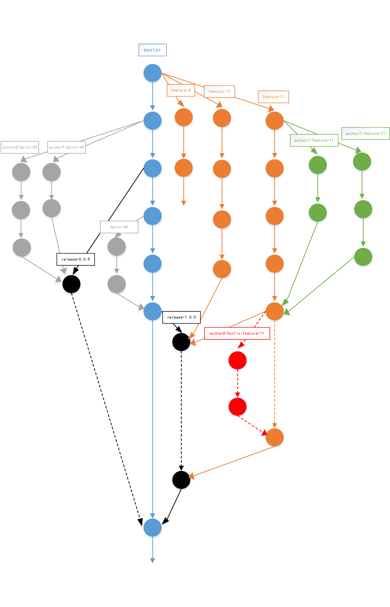

# Git分支管理策略2

## 说明

之前的[文章](git-branch.md)中阐述了一种较为复杂的git分支工作流，其核心思想是参考了[Linux](https://github.com/torvalds/linux)等超大项目的工作流机制，可能更觉适合一些迭代较为频繁复杂以及合作人数较多的场景。

本篇文章将会阐述另一种git工作流机制，更加适用较为简单的场景。

## 参考文章

- [A successful Git branching model](http://nvie.com/posts/a-successful-git-branching-model/)
- [issue4](http://gitlab.baidu.com/scloud-fe/workflows/issues/4)

## ChangeLog

- 2014/09/23
    - create
- 2014/9/26
    - 添加 *代码的质量保证与备份*

## 目录

- 正文
    - 1 思路
    - 2 分支说明
        - 2.1 `master`分支
        - 2.2 `feature`分支
        - 2.3 `author/feature`分支
        - 2.4 `release`分支
            - 2.4.1 `release`分支提测无问题
            - 2.4.2 `release`分支提测发现问题
            - 2.4.3 `feature`分支非线性发布
        - 2.5 `author/hotfix/feature`分支
        - 2.6 `maint`分支
            - 2.6.1 轻量维护
            - 2.6.2 多人维护
            - 2.6.3 维护完毕
    - 3 代码的质量保证与备份
    - 4 总结

## 正文

### 1 思路

为了减少分支的种类和复杂型，将不再采用除了`master`之外的 **LTS** （long time support） 类型的分支，按 **功能性** 将分支分为以下几种，

- feature-{{feature-id}}
- author/feature-{{feature-id}}
- release-{{release-version}}
- author/hotfix/feature-{{feature-id}}
- maint-{{issue-id}}

这样，一个完整的工作流可能如下图所示，

下面将作具体的说明。

### 2 分支说明

#### 2.1 `master`分支

`master`分支作为版本库中 **唯一的** 长期分支，也是版本库的 **主线** ，其作用是用于 *发布线上代码* 。 即 **线上产品跑的代码就是master分支上的代码** 。

**Tips** ： 版本库中除了`master`分支之外，其他 **所有的** 分支皆是 **临时分支** 。

#### 2.2 `feature`分支

当产品产出了新的需求后，理论上，需求都应该有一个确定的迭代周期，这个迭代周期即是需求的生命周期。

在具体的开发工作之前，我们应该做一项工作： **需求分解** 。（ *需求分解的相关文章将会在后面给出* ）

在 **需求分解** 工作之后，我们将会得到一系列的 **需求点** （ *feature point* ） ，同一个迭代周期的需求点将会都被包括在同一个 *Milestone* 中。此处我们将需求点抽象成相应的issue，每一个需求将会有一个 *issue-id* ，这样，我们`feature`分支的命名规则就形成了。

**`feature` + `-` + `feature-id`**

如上图中的`feature-11`，`feature-12`等。

此处的`feature-id`即是每一个需求点的 *issue-id* 。

所以，`feature`分支就是一个个需求点的实际产出。如上图中 *橘红色* 的分支。

**Tips** :`feature`分支都是从`master`分支迁出的，不过其归宿是后面将要说到的`release`分支。 （因为这其中涉及到功能非线性发布以及测试的问题）

#### 2.3 `author/feature`分支

此分支相比`feature`分支多了一个`author`前缀！显而易见，`author/feature`分支将会与具体的rd相关联。

所以，它的作用就是， **针对某一需求点不同rd的合作实现** 。其命名规则如下，

**`author` + `/` + `feature`**

如上图中的`author1/feature-11`等。

因为此分支跟具体的rd相关联，实际上它相当于某一rd的 **个人开发分支** 。一般情况下，rd的个人开发开发都是 **由自己维护** ，别人不会涉及的。

**Tips** ：`author/feature`分支都是从某一`feature`分支迁出的，经过一段时间的开发之后，它将会合并回之前的`feature`分支。

### 2.4 `release`分支

当我们有发布需求时，我们从`master`上的迁出`release`分支作为某一次发布的容器。

因为发布时会带有相应的版本信息，所以我们`release`分支的命名规则如下，

**`release` + `-` + `release-version`**

如上图中的`release-1.0.0`。

一般情况下，当一个需求迭代周期即将结束的时候，我们进行功能发布。此时，我们将此次迭代周期中产生的 **所有** `feature`分支合并进`release`分支，然后对此`release`分支提测。

#### 2.4.1 `release`分支提测无问题

相比现在我们直接在`master`上进行测试这一做法，我们更加提倡先在相应的`release`分支进行 **详细测试** ，若确认没有问题，将`release`分支合并进`master`分支，然后 **再回归覆盖** `master`分支。

`master`分支经 **回归覆盖** 后，仍然没有问题，即可进行打 *TAG* 及打包动作进行发布。

#### 2.4.2 `release`分支提测发现问题

若`release`分支在提测中发现了问题，经过定位之后，确定问题来源（定位到相关的`feature`分支），由相应rd在相应的`feature`分支上迁出`author/hotfix/feature`分支进行快速修复。

修复完毕之后，rd自测进行确认，然后将`hotfix`分支合并至相应的`feature`分支，然后重复之前`release`分支提测的动作。

#### 2.4.3 `feature`分支非线性发布

在实际的功能发布中，我们可能遇到这样一种情况，

一个迭代周期进行 **多次发布** ，每次发布仅包含所有`feature`分支中的某几个。

针对这种情况，我们在迁出特定的`release`分支之后，将需要发布的`feature`分支合并进`release`分支即可，后面操作与之前并无二样！

这样就可以使用不同的`release`分支进行非线性发布，他们的区别在于`release`分支的版本号不同。

**Tips** ：`release`分支由`master`分支迁出，最终也将合并进`master`分支。

### 2.5 `author/hotfix/feature`分支

如前所述，当`release`分支进行提测时发现问题时，进行定位之后，由相应rd进行修复动作。

所以`auther/hotfix/feature`的命名规则如下，

**`author` + `/` + `hotfix` + `/` + `feature`**

如上图中的 `author8/hotfix/feature-11`。

需要注意的一点是，快速修复分支与之前的`author/feature`分支一样，都是属于 **个人开发分支** 。

**Tips** ：`author/hotfix/feature`分支从`feature`分支迁出，最终也将合并进`feature`分支。

### 2.6 `maint`分支

线上代码可能会出现各种问题，比如

- 用户反馈的问题
- 可以优化的地方
- 测试未被发现的问题
- ...

这里的`maint`分支就是为这些问题准备的，它的作用就是维护`master`分支上可能出现的各种问题。

#### 2.6.1 轻量维护

当出现这些问题之后，相关人员会在 *issue list* 中提出相关 *issue* ，所以`maint`分支的命名规则如下，

**`maint` + `-` + `issue-id`**

如上图中的`maint-44`。

#### 2.6.2 多人维护

此外， **这里还可能会出现另一种情况** ，就是，

当 *issue* 中的问题涉及 **多名rd** ，需要合作修复时，此时`maint`分支将会有一种变形，

**`author` + `/` + `maint` + `-` + `isuue-id`**

如上图中的`author8/maint-45`，`author9/maint-45`。

#### 2.6.3 维护完毕

当`maint`分支的修复工作完成之后，需要进行相应的修复发布，这里的操作与之前的`release`分支类似，具体可以请参阅上图。

这里，有一个问题需要提一下，

当`maint`中涉及的问题比较轻量，属于那种可以快速修复的，这种情况下，可以略过`release`分支，减少提测过程，简化发布操作。如图中的`maint-44`分支。

具体如何操作应该视具体情况来确定。

### 3 代码的质量保证与备份

#### 3.1 merge request & code review

在多人合作开发中， *merge request* 和 *code review* 是保证团队代码质量的一种有效手段。

rd在对自己的个人分支进行合并之前，应该都需要在gitlab上创建一个 *merge requst* ，并指定相关责任人进行 *code review* 。

#### 3.2 代码备份

我们现在都是在[gitlab](http://gitlab.baidu.com/)平台上进行工作，由于一些客观原因，我还需要将代码做一份完整备份至svn服务器。

这里有一份gitlab提供的[备份指南](http://gitlab.baidu.com/store/git2svn/tree/master)提供git至svn服务器的单向同步。

### 4 总结

- 在具体的开发及修复工作之前，应该明确问题，确定使用哪一种分支
- 规范分支的命名
- 维护好自己的个人分支，避免分支泛滥
- 公用分支避免相互合并，`feature`分支的迁出及`release`分支的合并最好由一个人来操作
- 将个人分支合并进公用分支之前，尽量压缩冗余的无用的改动集，保持公用分支的干净
- 进行代码合并操作时，应该尽量使用 *merge request* 和 *code review* ，明确每次合并动作带来的结果是否符合预期
- ...

