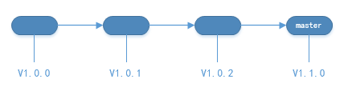
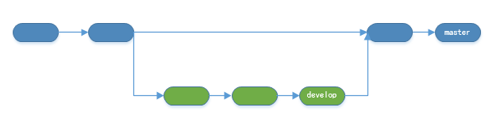
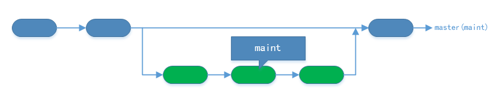
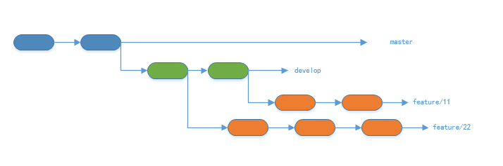
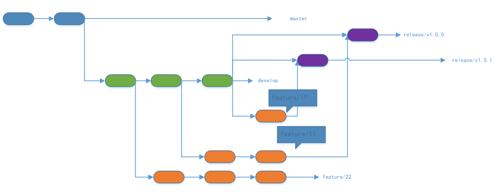
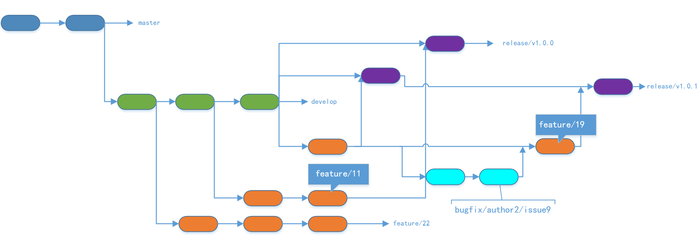
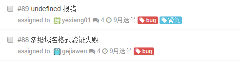
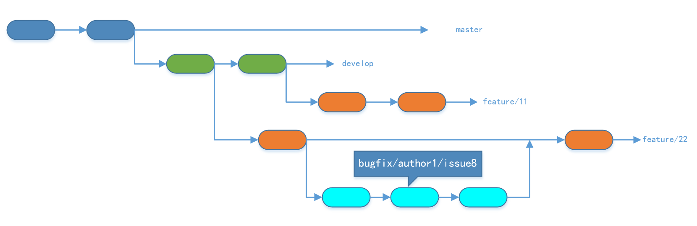
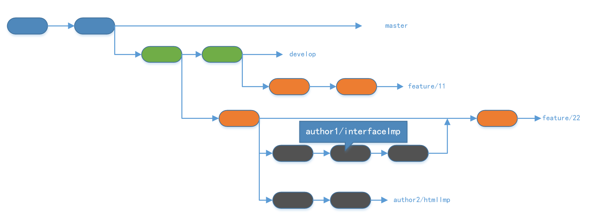

# Git分支管理策略

## 说明
本文不是一篇git教程式的文章，本文写作的目的是 **制定一个大家认可的通用规范，提供基于git多分支模型工作流的一般性指导。** 

添加说明，**这篇文章抽象的git工作流相对来说复杂一点，可能更加适用团队人数多、需求迭代频繁的场景。**

## 参考文章

- [阮一峰的文章](http://www.ruanyifeng.com/blog/2012/07/git.html)
- [A successful Git branching model](http://nvie.com/posts/a-successful-git-branching-model/)
- [Google](http://google.com)
- git bash: git help workflows

## ChangeLog

- 2014/9/11
    - create
- 2014/9/19
    - 更新图片路径
    - 添加额外说明

## 目录

- 1 正文
    - 1.1 场景
    - 1.2 解决思路
    - 1.3 master分支
    - 1.4 develop分支
    - 1.5 maint分支
    - 1.6 feature/{{feature-id}}分支
    - 1.7 release/{{release-version}}分支
    - 1.8 bugfix/{{author}}/{{what}}分支
    - 1.9 {{author}}/{{what}}分支
- 2 一般原则
- 3 Next

## 1 正文

### 1.1 场景

鉴于我们当前的版本控制和工作流，虽然有一些基本的已定策略，但是然后有一些问题在实际的开发工作中暴露了出来。

下面是我们在一个需求迭代周期中，可能会涉及的方面：

- 一个迭代周期中包含多个feature，但是feature可能彼此相互独立，亦可能相互依赖。
- feature往往由多名职责不同的rd做具体不同的实现。
- 迭代周期中的feature在上线时往往并不是线性的。
- feature实现与测试相互割裂。
- 维护及bug修复工作最好是可以持续的、可追溯的。

### 1.2 解决思路

除了`master`分支之外，我们将设立如下几个 **LTS** （ *long-time support* ）分支，

- `develop`  日常开发分支
- `maint`  日常维护及bug修复分支

除了`master`和 **LTS** 分支之外，我们还将会有一些特殊用途的 **临时分支**，

- `feature/{{feature-id}}`  功能开发分支
- `release/{{release-version}}`  预发布分支
- `bugfix/{{author}}/{{what}}`  相应rd针对特定问题的调试追踪分支
- `{{author}}/{{what}}`  不同职责rd的个人开发分支
- ~~`{{author}}/hotfix` 相应rd的快速修复分支~~

下面针对这些分支分别做详细的说明。

### 1.3 master分支

`master`作为版本库的默认分支，有且只有一个，往往作为代码的发布分支，即 **线上产品跑的代码 = master分支上的代码** 。

一般而言，不推荐在`master`分支上直接提交代码。

### 1.4 develop分支

`master`分支的作用是用来发布版本更新的，那么`develop`分支就是用来做日常的开发工作的。 **在最开始的时候，`develop`分支是由`master`上迁出的** 。

`develop`分支是一个 **LTS** （ *long-time support* ）分支，即它和`master`分支一样，其生命周期贯穿整个版本库的生命周期。

当在`develop`分支的开发告一段落之后，我们将`develop`合并到`master`分支即可。（这里暂时忽略测试的环节，后面会有详细的说明。）

如上图所示，`develop`分支在开发一段时间后，我们将其合并到`master`分支中。

这里有一点需要特别提出来作说明， **我们推荐使用 `--no-ff` 的形式进行分支合并** 。

是否使用`--no-ff`的区别如下，

可见，

- `--no-ff`方式进行合并，总是生成合并提交改动
- 快进方式进行合并，将会试图将不同的分支保持在一条branch line上

为了保证版本演进的清晰，我们希望采用这种做法。关于合并的更多解释，请参考Benjamin Sandofsky的[《Understanding the Git Workflow》](http://sandofsky.com/blog/git-workflow.html)。

### 1.5 maint分支

`maint`分支是一个 **LTS** 分支，其作用是用于主线branch的日常维护及bug修复。

往往我们会遇到这样一个场景，

刚刚发布了一个新的版本，可是一些细节的小问题在review及test的时候由于种种原因都未能发现。此时我们需要一个能够及时修复的解决方案，`maint`分支产生了。（这仅是`maint`分支作为 **LTS** 分支存在的原因之一，这里仅仅是用来举例。）

从某一种意义上说，`maint`分支是`master`分支的 *影子* 。

总结，

- `maint`分支 **由`master`分支迁出**
- 在使用`maint`分支之前，应该先检查是否落后当前的`master`分支，如果落后，则应该 **先对`maint`分支进行`rebase`操作** （这里就体现了`maint`是`master`的影子这一观点 ）
- 一般来说，同一时刻只会有一个问题需要在`maint`分支上进行快速修复，因为致命问题经过review和test后还未被发现的概率应该是比较小的。

### 1.6 feature/{{feature-id}}分支

一个迭代周期将会对应一个milestone，在milestone中将迭代需求分解成众多的feature point，在milestone中以issue的方式提出。 **即 一个issue-id将会对应feature point** ，此`issue-id`即为`feature-id`。

如上图所示，所有的`feature`分支，

- 都是 **临时** 分支
- 都是 **由`develop`分支迁出**
- **理论上** 都是彼此相互独立的

### 1.7 release/{{release-version}}分支

所谓的预发布分支，从某种意义上来说就是一个测试分支。

在发布正式版本之前（即将`feature`分支合并到`master`分支之前），我们可能需要有一个预发布的版本进行测试。

若预发布分支在测试的过程中 **没有遇到问题** ，比如预发布分支`release/v1.0.0`经测试未发现问题，则将此预发布分支分别 **合并进`master`分支和`develop`分支** ，如下图所示：

若预发布分支在测试的过程中 **遇到问题** ，比如预发布分支`release/v1.0.1`经测试发现了问题，则此时QA及bug发现者应该在issue list中贡献相应的bug描述，并分配相应的rd进行修复。

rd在feature分支上迁出`{{author}}/bugfix/{{what}}`分支进行修复工作，修复完毕之后合并进feature分支，最后将修复后的feature分支再合并进之前出问题的预发布分支再次进行测试。如下图所示：

总结，

- `release/{{release-version}}`分支都是 **由`develop`分支迁出**
- 将需要发布的 **任意多个** 功能分支`feature/{{feature-id}}`合并进预发布分支进行测试
    - 可以灵活的针对需要发布或者测试的feature分支进行
- 测试过程中遇到问题，要追溯到相关的`feature/{{feature-id}}`分支上并迁出`bugfix/{{author}}/{{what}}`分支（ *此分支更多的相关说明，请参见[`bugfix/{{author}}/{{what}}`分支](#1-8-bugfix-author-what)* ）进行修复工作
- 测试通过之后，将预发布分支分别合并到`master`分支和`develop`分支中
- **视具体情况** 删除预发布分支和feature分支

### 1.8 bugfix/{{author}}/{{what}}分支

在`release/{{release-version}}`中进行测试时，可能将会遇到各种bug。此时QA及bug发现者应该在issue list中贡献相应的bug描述。

如下图所示，

某一rd接到分配的issue时，即可开始在相应的`feature/{{feature-id}}`分支中迁出`bugfix/{{author}}/{{what}}`分支进行相关修复工作。

其中`{{what}}`变量一般跟随 **issue-id** ，修复完毕之后，将bugfix分支合并进相应的feature分支。

比如上图中 *issue88* 的assignee应该在相应的feature分支迁出bugfix分支 `bugfix/gejiawen/issue88`

### 1.9 {{author}}/{{what}}分支

此分支用于各rd针对不同feature的具体实现。其中`{{what}}`变量的内容由rd自行确定。

总结，

- `{{author}}/{{what}}`分支将是rd的具体实现，其命名和数量一般来说都没有限制
- `{{author}}/{{what}}`分支 **必须** 是 **由某一特定的feature分支迁出的**
- rd在`{{author}}/{{what}}`分支上完成具体实现后，可以merge到相应的`feature`分支进行自测。
- `{{author}}/{{what}}`分支一般来说依赖`{{author}}`变量进行追溯，如需必要请勿修改他人的实现分支

## 2 一般原则

- 明确 **LTS** 分支与 **临时** 分支之间的所属关系
- 若无必要，请勿在他人的个人分支上工作
- 常用`git branch -a | grep {{author}}`管理自己名下的分支
- 一般而言，`master`, `develop`, `maint`, `feature-{{feature-id}}`之间不推荐相互merge
- ...

## 3 next

接下来我们将会陆续放出工作流中涉及到的方方面面，

- issue管理策略
- milestone及需求分解
- 合作文档的编写
- ...