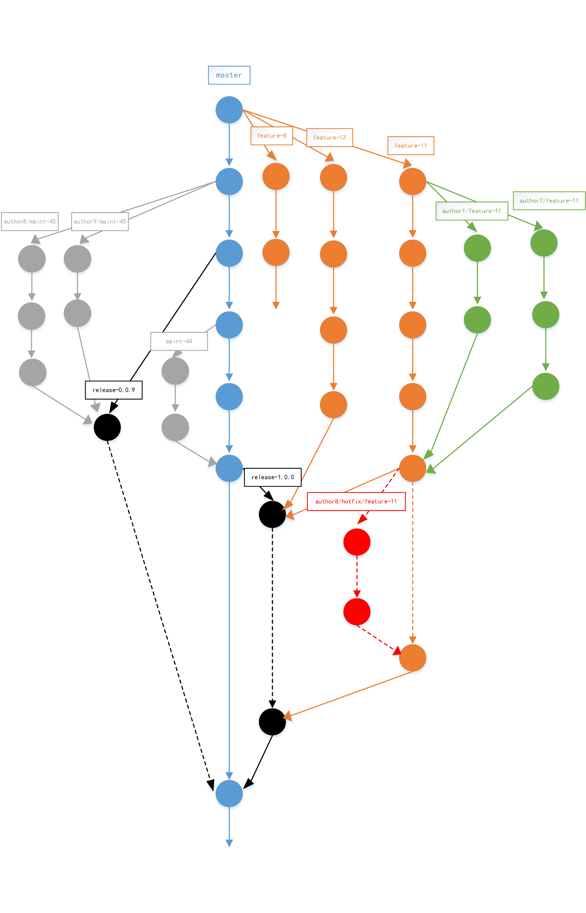

# Git分支模型二

Git分支模型一中阐述了一种较为复杂的git分支工作流，其核心思想是参考了[Linux](https://github.com/torvalds/linux)等超大项目的工作流机制，可能更觉适合一些迭代较为频繁复杂以及合作人数较多的场景。

本篇文章将会阐述另一种git工作流机制，更加适用较为简单的场景。

## 思路

为了减少分支的种类和复杂型，将不再采用除了`master`之外的 **LTS** （long time support） 类型的分支，按 **功能性** 将分支分为以下几种，

- feature-{{feature-id}}
- author/feature-{{feature-id}}
- release-{{release-version}}
- author/hotfix/feature-{{feature-id}}
- maint-{{issue-id}}

这样，一个完整的工作流可能如下图所示，

下面将作具体的说明。

## `master`分支

`master`分支作为版本库中 **唯一的** 长期分支，也是版本库的 **主线** ，其作用是用于 *发布线上代码* 。 即 **线上产品跑的代码就是master分支上的代码** 。

**Tips** ： 版本库中除了`master`分支之外，其他 **所有的** 分支皆是 **临时分支** 。
