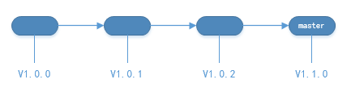
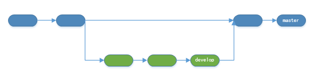
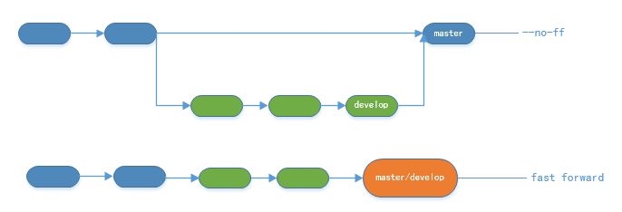
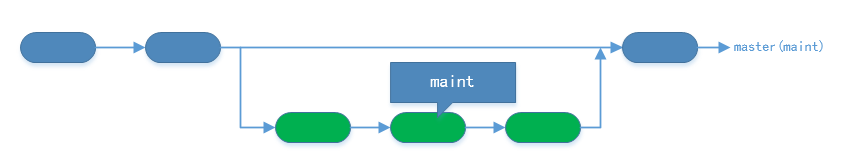
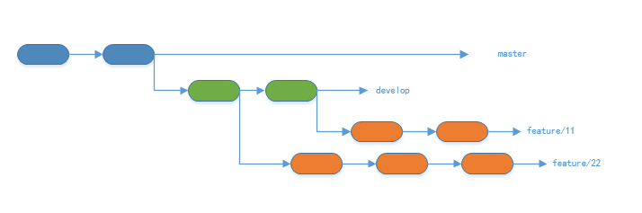

# Git分支模型一

## 场景

- 一个迭代周期中包含多个feature，但是feature可能彼此相互独立，亦可能相互依赖。
- feature往往由多名职责不同的rd做具体不同的实现。
- 迭代周期中的feature在上线时往往并不是线性的。
- feature实现与测试相互割裂。
- 维护及bug修复工作最好是可以持续的、可追溯的。

## 解决思路

除了`master`分支之外，我们将设立如下几个 **LTS** （ *long-time support* ）分支，

- `develop`  日常开发分支
- `maint`  日常维护及bug修复分支

除了`master`和 **LTS** 分支之外，我们还将会有一些特殊用途的 **临时分支**，

- `feature/{{feature-id}}`  功能开发分支
- `release/{{release-version}}`  预发布分支
- `bugfix/{{author}}/{{what}}`  相应rd针对特定问题的调试追踪分支
- `{{author}}/{{what}}`  不同职责rd的个人开发分支
- ~~`{{author}}/hotfix` 相应rd的快速修复分支~~

下面针对这些分支分别做详细的说明。

### master分支

`master`作为版本库的默认分支，有且只有一个，往往作为代码的发布分支，即 **线上产品跑的代码 = master分支上的代码** 。

一般而言，不推荐在`master`分支上直接提交代码。

### develop分支

`master`分支的作用是用来发布版本更新的，那么`develop`分支就是用来做日常的开发工作的。 **在最开始的时候，`develop`分支是由`master`上迁出的** 。

`develop`分支是一个 **LTS** （ *long-time support* ）分支，即它和`master`分支一样，其生命周期贯穿整个版本库的生命周期。

当在`develop`分支的开发告一段落之后，我们将`develop`合并到`master`分支即可。（这里暂时忽略测试的环节，后面会有详细的说明。）

如上图所示，`develop`分支在开发一段时间后，我们将其合并到`master`分支中。

这里有一点需要特别提出来作说明， **我们推荐使用 `--no-ff` 的形式进行分支合并** 。

是否使用`--no-ff`的区别如下，

可见，

- `--no-ff`方式进行合并，总是生成合并提交改动
- 快进方式进行合并，将会试图将不同的分支保持在一条branch line上

为了保证版本演进的清晰，我们希望采用这种做法。关于合并的更多解释，请参考Benjamin Sandofsky的[《Understanding the Git Workflow》](http://sandofsky.com/blog/git-workflow.html)。

maint分支

`maint`分支是一个 **LTS** 分支，其作用是用于主线branch的日常维护及bug修复。

往往我们会遇到这样一个场景，

刚刚发布了一个新的版本，可是一些细节的小问题在review及test的时候由于种种原因都未能发现。此时我们需要一个能够及时修复的解决方案，`maint`分支产生了。（这仅是`maint`分支作为 **LTS** 分支存在的原因之一，这里仅仅是用来举例。）

从某一种意义上说，`maint`分支是`master`分支的 *影子* 。

总结，

- `maint`分支 **由`master`分支迁出**
- 在使用`maint`分支之前，应该先检查是否落后当前的`master`分支，如果落后，则应该 **先对`maint`分支进行`rebase`操作** （这里就体现了`maint`是`master`的影子这一观点 ）
- 一般来说，同一时刻只会有一个问题需要在`maint`分支上进行快速修复，因为致命问题经过review和test后还未被发现的概率应该是比较小的。

### feature/{{feature-id}}分支

一个迭代周期将会对应一个milestone，在milestone中将迭代需求分解成众多的feature point，在milestone中以issue的方式提出。 **即 一个issue-id将会对应feature point** ，此`issue-id`即为`feature-id`。

如上图所示，所有的`feature`分支，

- 都是 **临时** 分支
- 都是 **由`develop`分支迁出**
- **理论上** 都是彼此相互独立的