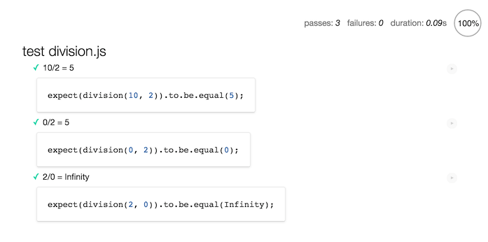
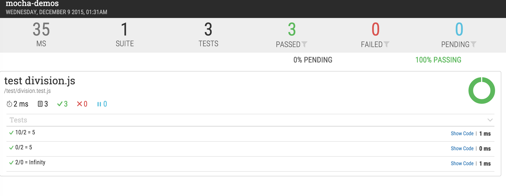

# 如何写单元测试

所谓单元测试就是针对模块做功能性测试。

这里我将以[Mocha](http://mochajs.org/)为例，介绍如何在项目中，基于NodeJS环境做单元测试。

## 介绍及安装

[Mocha](http://mochajs.org/)是我的偶像之一[TJ Holowaychuk](https://github.com/tj)发起的一个项目。它拥有很多特性，而且非常极客，使用方法也很简单。总之你知道它很吊就是了。😄😄

Mocha既可以用在Node.js环境也可以用在浏览器环境。我们先来看看在Node.js环境中是如何使用Mocha的。

首先，我们通过npm来安装mocha。

```javascript
$ npm install -g mocha
```

一般来说，在具体的项目中，我们还需要将mocha安装到`devDependencies`中，因为mocha的工作是用来做测试的，所以它不应该出现在`dependencies`依赖中。

还有一点需要说明的是，mocha并不限制你使用何种断言风格，言下之意，市面上的几种流行断言库，它都是支持的。

## 常规用法

接下来我们介绍一下在项目中如何去实际的使用mocha。

假如我们的项目文件结构如下，

```
|- controllers
|-- division.js
|- models
|- views
|- services
|- app.js
|- package.json
```

我们在根目录上新建一个文件夹，叫做test。我们所有的测试文件都将放在这个文件夹中。

假设我们的`division.js`内容如下，

```javascript
function division(x, y) {
    return x / y;
}

module.exports = division;
```

我们的需求是要测试这个做除法运算的文件。测试内容应该包括各种边界情况。我们首先新建一个`division.test.js`文件，其内容如下，

```javascript
var division = require('../controllers/division');
var expect = require('chai').expect;

describe('test division.js', function() {
    it('10/2 = 5', function() {
        expect(division(10, 2)).to.be.equal(5);
    });
    
    it('0/2 = 5', function() {
        expect(division(0, 2)).to.be.equal(0);
    });
    
    it('2/0 = Infinity', function() {
        expect(division(2, 0)).to.be.equal(Infinity);
    });
});
```

注意，这里我们使用`chai`断言库，而且使用的是**expect**断言风格。

测试文件中定义了一个测试套件，名字叫做"test division.js"，这个测试套件下又定义了3个测试用例。现在我们来运行mocha，看看测试的结果如何。

```bash
 test division.js
    ✓ 10/2 = 5
    ✓ 0/2 = 5
    ✓ 2/0 = Infinity


  3 passing (9ms)
```

从结果来看，我们写的三个测试用例都通过了。非常棒！

如果假设我们现在是个小学生，我们会以为'2/0=0'。修改相关的测试用例，再看看mocha执行的结果是什么。


## 异步测试

在对某些业务逻辑进行测试的时候，很可能会遇到这样一种情况。业务中可能包含异步逻辑。这时候我们的测试用例该如何来写呢？

我们看一个例子，

```javascript
var request = require('superagent');
var expect = require('chai').expect;

describe('async test', function () {
    it('异步请求应该返回一个对象', function (done) {
        request
            .get('https://api.github.com')
            .end(function(err, res){
                expect(res).to.be.an('object');
                done();
            });
    });
});
```

其结果如下，

```bash
async test
    ✓ 异步请求应该返回一个对象             (1258ms)


  1 passing (1s)
```

这个例子中我们使用`superagent`来请求一个远程api，在请求返回的回调函数中，我们进行了断言判断。注意，这里在声明测试用例时，我们给回调函数传入了一个`done`参数，这个参数其实也是一个函数。我们在断言语句之后，**显式**的调用这个函数，表明异步任务语句结束了。从结果中也能看出，这个测试用例总共耗时1258ms。

如果某个异步操作的耗时非常长，超过了2000ms，那么此时mocha会默认这个测试为失败。比如，

```javascript
// timeout.test.js
var expect = require('chai').expect;

describe('timeout test', function() {
    it('should finished in 5000ms', function(done) {
        var x = true;
        var f = function() {
            x = false;
            expect(x).to.be.not.ok;
            done();
        };
        setTimeout(f, 4000);
    });
});
```

它的结果是如下，

```bash
timeout test
    1) should finished in 5000ms


  0 passing (2s)
  1 failing

  1) timeout test should finished in 5000ms:
     Error: timeout of 2000ms exceeded. Ensure the done() callback is being called in this test.
```

可见，我们的测试用例并没有通过。mocha认为如果一个测试用例2000ms还没有结束，那么就默认这个测试用例不通过。这种情况下，我们可以通过下面的方式来修改这个默认超时时间。

```bash
$ mocha timeout.test.js -t 5000
```


## 用在浏览器上

前面都是在说Node.js环境下如何去使用mocha，其实我们也可以在browser环境使用mocha。

在命令行中执行`mocha init`，这个命令会在目录下生成一个`index.html`文件，然后我们将`mocha.js`，`chai.js`以及测试文件和待测试文件加入到这个html中。比如，

```html
<!DOCTYPE html>
<html>
  <body>
    <h1>Unit.js tests in the browser with Mocha</h1>
    <div id="mocha"></div>
    <script src="mocha.js"></script>
    <script src="chai.js"></script>
    <script src="division.js"></script>
    <script>
      mocha.setup('bdd');
    </script>
    <script src="division.test.js"></script>
    <script>
      mocha.run();
    </script>
  </body>
</html>
```

然后我们直接使用浏览器打开就可以了。效果如下。



## 生成测试用例报告

mocha内置了多种测试报告风格，默认使用的是`spec`风格。我们可以通过，

```bash
$ mocha --reporter [report-style]
```

来选择不同的报告风格。

`$ mocha --reporters`将会列出所有内置的风格。可以根据自己的喜好选择使用。

除了内置的报告风格之外，我们还可以使用一个叫做[mochawesome](http://adamgruber.github.io/mochawesome/)的第三方模块，来生成比较美观的html文档报告。

其用法如下，

```javascript
$ npm install --save-dev mochawesome
$ mocha --reporter mochawesome
```

它将会生成一个**mochawesome-reports**的文件夹，打开里面的`index.html`就可以看到测试报告了。效果如下，

